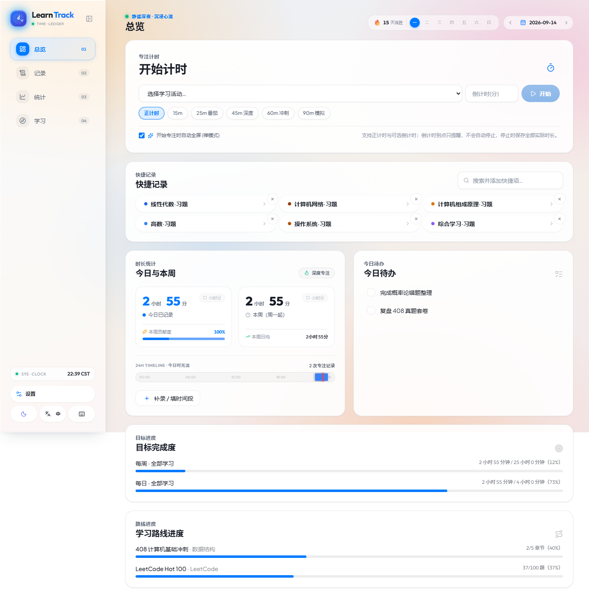
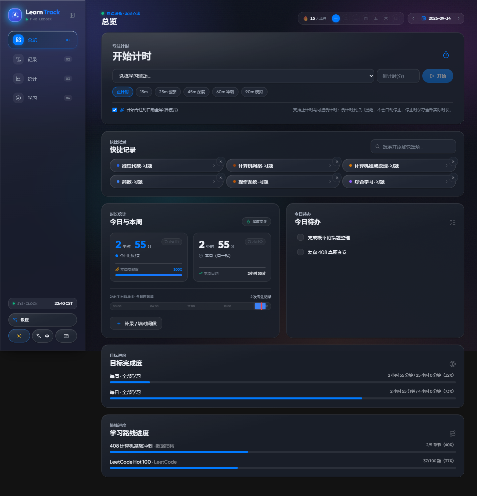
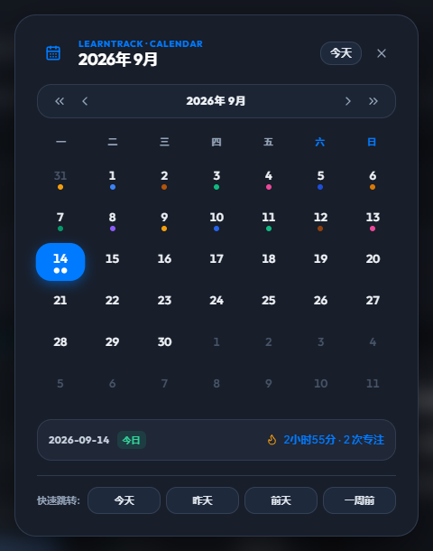
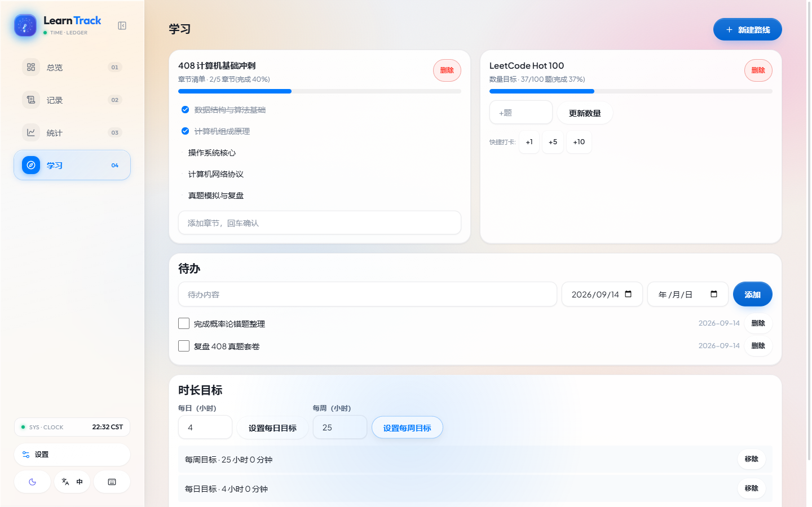

<div align="center">

<p align="center">
  
</p>

# ⏱️ LearnTrack

**本地优先 · 液态玻璃美学 · 高精度学习时间账本**

*每一次专注都清晰可感，每一份投入皆有迹可循。*

[](LICENSE)
[](https://www.typescriptlang.org/)
[](https://reactjs.org/)
[](https://vitejs.dev/)
[](https://dexie.org/)
[](https://echarts.apache.org/)
[](packages/domain/src/index.test.ts)
[](#-贡献指南-contributing)

[功能特性](#-核心功能特性) • [UI 视觉与交互美学](#-ui-视觉与交互美学) • [真机运行预览](#-真机运行预览) • [快速开始](#-快速开始) • [架构设计](#-架构设计) • [技术栈](#-技术栈) • [开源协议](#-开源协议)

</div>

---

## 🌟 项目简介

**LearnTrack** 是一款专为终身学习者、考研考证党与深度思考者打造的 **本地优先（Local-First）学习时间记账与自我量化工具**。

不同于依赖持续联网的打卡软件，LearnTrack 遵循 **“本地优先、极速响应、同步可控”** 原则。学习与专注数据默认存储在浏览器本地数据库（IndexedDB）中；只有在用户主动配置私有同步服务后，数据才会进入同步流程。界面采用**液态拟物玻璃（Liquid Glass）视觉体系**与**原生微机械动效**，为进入学习状态提供清晰而克制的仪式感。

---

## 🎨 UI 视觉与交互美学

LearnTrack 在 UI 细节与动效质感上进行了深度打磨，融合了拟物物理质感与现代数字界面的通透灵动：

### 1. 纯色卡片鼠标动态聚光（Spotlight Cursor Follow）
全局信息卡片带有随光标移动的柔和聚光效果（Radius 420px），并通过 `requestAnimationFrame` 节流更新位置，在高刷新率屏幕上也能保持流畅。

### 2. 精密机械联动时计（Mechanical Chronograph Logo）
界面左上角标识内置自研 SVG 机械轮系：外层天体刻度星齿以 18 秒周期顺时针运转，中层测速轨道逆时针环绕，精密时针与秒针呈 6:1 机械差速匀速滑扫，鼠标悬停时自动激发加速齿轮啮合动效。

### 3. 全屏沉浸专注模式（Zen Mode & Flow Field）
一键全屏隐藏所有侧边栏与繁杂干扰，中央呈现呼吸律动时针大表盘。内置 **纯原生 Web Audio 声学心流场**，无需下载任何外部音频文件，零网络开销动态合成真实雨声、深海潮汐与阻断脑电波杂讯的 1/f² 深度棕色噪点（Brown Noise）。

### 4. 几何无点圆润数字排印（Tick-Text Typography）
告别传统生硬的打孔数字，全局数字均采用圆润饱满的几何几何字体，并强制开启 OpenType `tnum`（等宽对齐）与 `zero: 0` 特性，确保倒计时跳动、秒数递增时数字骨架绝对稳固、零晃动。

### 5. 晶体高对比度微热力日历（Glass Calendar）
剔除冗余遮挡滤镜，以纯粹的高透晶体面板呈现当月日期。每个日期格子底部配备活动微型多色指示点（Activity Micro-Dots），支持上一年/下一月快速穿梭与一键回溯历史复盘。

---

## 📸 真机运行预览

以下画面来自 **2026-09-14 的 Windows 桌面浏览器实测**，不是设计稿或空状态占位图。测试库通过应用界面实际录入：共 **16 条学习记录、连续 15 个活跃日、总计 20 小时 50 分钟**，覆盖数学、408、英语、算法与政治五个领域；同时创建 2 条学习路线、2 项今日待办，以及每日 4 小时 / 每周 25 小时目标。

| 实测项 | 本次验证数据 |
| :--- | :--- |
| 月度统计 | 2026 年 9 月 15 条记录，14 个活跃日，共 18 小时 40 分钟 |
| 连续记录 | 2026-08-31 至 2026-09-14，连续 15 天 |
| 章节路线 | `408 计算机基础冲刺`：2/5 章，完成 40% |
| 数量路线 | `LeetCode Hot 100`：37/100 题，完成 37% |
| 运行视口 | Chromium 桌面浏览器，1440 × 900 / 1050 |

### 1. 仪表盘全景（Dashboard）

浅色与深色主题均在同一组实测数据下截取。可见今日 2 小时 55 分钟、2 次专注记录、待办、时长目标与路线进度联动。

<p align="center">
  
  
</p>

### 2. 统计看板（Analytics）

切换到“本月”口径后，趋势图、领域分布与具体科目排行均由 9 月份的 15 条记录计算生成，不再使用“加载中”占位画面。

<p align="center">
  
</p>

### 3. 晶体热力日历与复盘穿梭（Glass Calendar）

日历中的彩色活动点来自连续 15 天的真实测试记录；选中 9 月 14 日可回看当日 **2 小时 55 分钟 / 2 次专注**，并可快捷跳转今天、昨天、前天或一周前。

<p align="center">
  
</p>

### 4. 体系化学习路线（Learning Paths）

同时验证章节清单与数量目标两种路线模型：章节勾选、进度条、快捷打卡、今日待办和日/周时长目标均可正常写入并即时更新。

<p align="center">
  
</p>

---

## ✨ 核心功能特性

### ⏱️ 专注计时与时间账本
- **正计时 / 倒计时**：专注中途支持随时暂停，自动闭合暂停区间；支持超额记录。
- **抗休眠与刷新恢复**：采用绝对壁钟时间戳（Wall-Clock Timestamps）恢复状态，电脑合盖休眠或误关页面，时长精准如初。
- **跨午夜智能分摊**：支持通宵或深夜学习记录，跨午夜段按当地日期自动拆解统计。
- **三级分类体系**：`大类领域 → 具体科目 → 细分活动`，支持多层级自定义专属颜色，历史记录永不因分类调整而丢失。

### 📊 深度量化与统计洞察
- **重构双层分布圆盘**：实心内圆代表核心大类，外围加粗粗环展示详细活动，外置独立高光投入数据条。
- **GitHub 风格年度贡献热力图**：全年度学习密度按 5 档色阶直观分布，点击任意网格直接下钻查看该日原始记录。
- **多维度交叉分析**：多科目日/周/月叠加渐变趋势图、单次时长区间分布（<30m、1h、2h+）及 24 小时精力分布波峰。

### 🛡️ 本地优先与隐私安全
- **离线可用**：至少成功访问一次并完成应用缓存后，核心记账、统计与音频合成都可在浏览器本地运行。
- **幂等同步引擎**：内置 Outbox 队列事务，联网后与私有同步服务（Node.js + SQLite）双向推送，版本冲突由用户自主裁决。
- **四重备份校验**：一键导出 JSON 镜像，导入前验证结构、计数、SHA-256 校验和与关系完整性；同时支持导出 CSV 供 Excel/Python 进阶分析。

---

## 🚀 快速开始

### 前置要求
- [Node.js](https://nodejs.org/) ≥ 20.0.0
- npm ≥ 10.0.0

### 本地开发

```bash
# 1. 克隆代码仓库
git clone https://github.com/PaoPao1021/LearnTrack.git
cd LearnTrack

# 2. 安装 Monorepo 所有依赖
npm install

# 3. 构建工作区依赖（干净克隆首次运行必需）
npm run build

# 4. 启动前端 Web 开发服务
npm run dev:web
```

启动完成后，在浏览器访问：**`http://localhost:5173`** 即可即刻体验。

### 可选：启动多端同步服务（API）

```bash
# 启动配套的 Fastify 同步服务端（默认运行在 http://localhost:8787）
npm run dev:api
```

> **说明**：无需启动 API 服务亦可完整使用全部时间记账、图表分析与数据导出功能。

---

## 🧪 自动化测试与质量保障

本次在 Node.js `v24.18.0`、npm `11.16.0` 环境下完成生产构建与全工作区复测。由于 Web 测试会读取工作区包的 `dist` 导出，干净克隆后应先构建、再运行测试：

```bash
# 执行生产环境编译打包检查（TypeScript 严格检查 + Vite 优化分包）
npm run build

# 运行全工作区单元测试（Vitest）
npm test
```

```text
✓ Production build: 2516 modules transformed, built in 1.62s
✓ packages/domain: 1 file, 14 tests passed (335ms)
✓ apps/api:         1 file,  3 tests passed (983ms)
✓ apps/web:         4 files, 12 tests passed (899ms)
────────────────────────────────────────────────────
Total: 6 test files, 29 tests passed
```

---

## 🏛️ 架构设计

```
┌─────────────────────────────────────────────────────────────┐
│                       浏览器宿主 (Web App)                    │
│                                                             │
│   ┌─────────────────────────────────────────────────────┐   │
│   │               React 18 + Tailwind UI 层              │   │
│   │   (Liquid Glass · Zen Mode · Chrono SVG · ECharts)  │   │
│   └──────────────────────────┬──────────────────────────┘   │
│                              │ 读写操作                      │
│                              ▼                              │
│   ┌─────────────────────────────────────────────────────┐   │
│   │           Dexie.js (浏览器 IndexedDB 本地库)          │   │
│   │  (Categories · Entries · Paths · Todos · Goals)     │   │
│   └──────────────────────────┬──────────────────────────┘   │
│                              │ 同事务双写                    │
│                              ▼                              │
│   ┌─────────────────────────────────────────────────────┐   │
│   │                 Local Outbox 事务队列                │   │
│   └──────────────────────────┬──────────────────────────┘   │
└──────────────────────────────┼──────────────────────────────┘
                               │ 在线时双向幂等同步 (Op-Log)
                               ▼
┌─────────────────────────────────────────────────────────────┐
│                    自托管私有同步服务 (Fastify)               │
│               SQLite · Session Auth · 冲突保留               │
└─────────────────────────────────────────────────────────────┘
```

---

## 🧱 技术栈

| 层次 | 技术选型 | 用途与优势 |
| :--- | :--- | :--- |
| **基础框架** | [React 18](https://react.dev/) + [TypeScript 5.6](https://www.typescriptlang.org/) | 强类型组件化开发，减少接口与状态错误 |
| **工程构建** | [Vite 8](https://vitejs.dev/) + [Rollup](https://rollupjs.org/) | 秒级热更新，生产环境智能代码分块 |
| **本地存储** | [Dexie.js](https://dexie.org/) (IndexedDB) | 纯前端本地持久化，支持响应式 liveQuery 查询 |
| **状态流转** | [Zustand 5](https://zustand-demo.pmnd.rs/) | 轻量、无样板代码，与 LocalStorage 实时同步时计状态 |
| **数据可视化** | [Apache ECharts 6](https://echarts.apache.org/) | 按需注册 Tree-shaking，支持全套无障碍读屏等价物 |
| **声音系统** | Web Audio API (Native Oscillator) | 100% 离线可用的心流场白噪音与微触感回馈音 |
| **样式体系** | [Tailwind CSS 3](https://tailwindcss.com/) + 自定义设计令牌 | CSS 变量驱动，支持深/浅主题与强调色切换 |
| **多语言** | 自研轻量类型安全 `i18n` | 支持简中、英文随心热切换，词条完整覆盖 |

---

## 📁 目录结构

```text
LearnTrack/
├── apps/
│   ├── web/                     # 前端单页应用（PWA · 离线优先）
│   │   ├── public/              # 静态资源与 PWA ServiceWorker
│   │   └── src/
│   │       ├── components/      # 通用液态玻璃组件（Modal, Combobox, Logo, Toast）
│   │       ├── features/        # 核心业务模块（Dashboard, Analytics, Entries...）
│   │       ├── services/        # 声音引擎 (Soundscape), 备份恢复, 指令队列
│   │       ├── stores/          # Zustand 状态机（计时器核心）
│   │       ├── db/              # Dexie 数据库架构与种子数据
│   │       └── styles/          # 全局设计令牌、卡片聚光灯与关键帧动画
│   └── api/                     # 极轻量私有同步服务（Fastify + SQLite）
├── packages/
│   ├── domain/                  # 核心纯函数领域层（时间算法、跨午夜分摊、统计模型）
│   └── contracts/               # 跨端 Zod 契约模式（同步协议、备份校验规范）
├── docs/                        # README 真机运行截图
└── infrastructure/              # 容器化部署脚本
```

---

## 🤝 贡献指南 (Contributing)

我们非常欢迎社区贡献！无论是新功能想法、UI 建议还是代码重构：

1. **Fork** 本仓库；
2. 新建你的功能分支 (`git checkout -b feature/amazing-feature`)；
3. 确保生产构建与测试通过 (`npm run build && npm test`)；
4. 提交你的更改 (`git commit -m 'feat: add some amazing feature'`)；
5. 推送到分支 (`git push origin feature/amazing-feature`)；
6. 提交 **Pull Request**！

---

## 📄 开源协议 (License)

本项目采用 [MIT License](LICENSE) 开源协议。你可以自由使用、修改与二次分发，但请保留原作者版权说明。

---

<div align="center">
  <sub>Built with ❤️ for lifelong learners. Keep learning, keep tracking.</sub>
</div>
