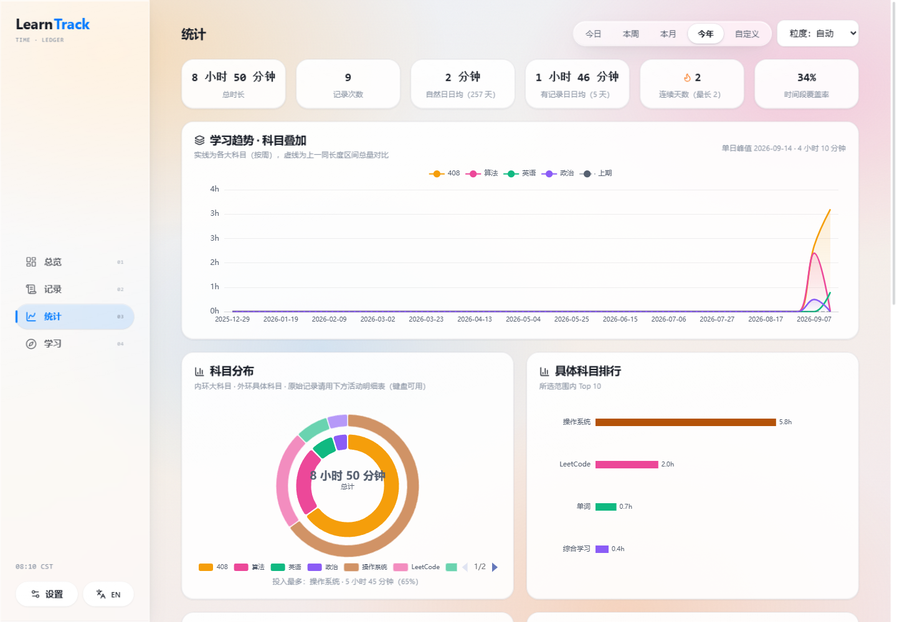
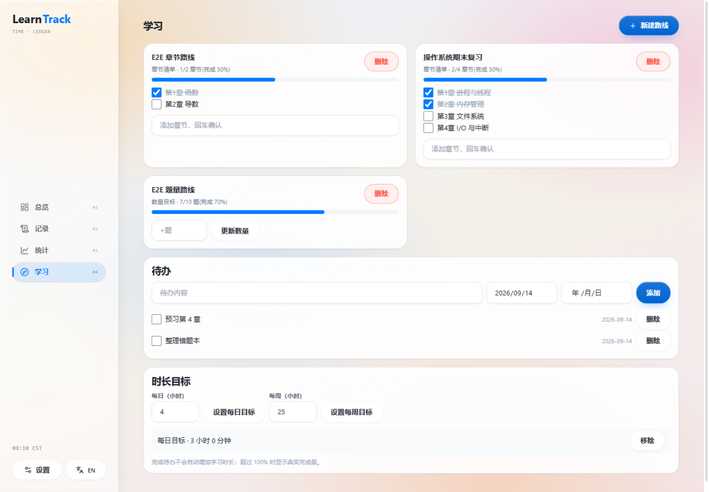

<div align="center">

# LearnTrack

**本地优先的学习时间账本 — 记录每一次专注，看清每一份投入**

React · TypeScript · Dexie · ECharts · 液态玻璃设计

[功能](#-功能特性) · [快速开始](#-快速开始) · [项目结构](#-项目结构) · [测试](#-测试) · [文档](#-文档) · [License](#-license)

</div>

---

## 📸 预览

| 总览（浅色 / 深色） |
| --- |
|  |
|  |

| 统计 | 学习 |
| --- | --- |
|  |  |

> 数据全部保存在浏览器本机（IndexedDB），无需注册即可使用；可选的同步服务用于多设备之间互相推送。

## ✨ 功能特性

**时间记账**
- ⏱️ **专注计时**：正计时 + 可选倒计时（到点只提醒，不打断），暂停区间合并计算，刷新后按绝对时间戳恢复
- ✍️ **灵活补录**：只填时长，或填写精确时间段（支持跨午夜，按本地日分摊）；重叠记录显式确认后完整计入（记录时长口径，不做静默去重）
- 🏷️ **三级分类**：大科目 → 具体科目 → 活动，内置常见学习分类；有数据的分类只可归档、不可删除，历史统计永不丢失

**统计洞察**
- 📈 **趋势**：多科目叠加渐变曲线 + 上一同长度区间对比，日 / 周 / 月粒度自动切换
- 🎯 **分布**：双层环形科目分布（中心总量）、科目排行、小时分布、单次时长分布、自评状态与打断统计
- 🔥 **热力图**：GitHub 贡献图风格的本年度学习热力图，五档色阶，点击任意一天查看原始记录
- ♿ **图表可访问**：所有图表带读屏摘要与数据表等价物，支持键盘操作与下钻

**学习管理**
- 🗺️ **学习路线**：章节清单（两层，可批量粘贴）或数量目标；记录时间时可顺带推进进度，删除记录可精确撤销关联进度
- ✅ **待办**：计划日期 + 截止日期，逾期高亮
- 🎯 **时长目标**：每日 / 每周目标完成度，超 100% 显示真实完成量

**数据与体验**
- 💾 **本地优先**：数据保存在本机浏览器，离线完全可用；所有写入进入本地 outbox 队列，联网后自动推送
- 🔄 **可选同步**：连接同步服务后多设备推送 / 拉取，按 opId 幂等、版本冲突双候选保留并由用户手动解决
- 💼 **备份**：一键导出完整备份（含未同步状态，结构 / 计数 / 校验和 / 标识四重校验）；CSV 导出用于分析
- 🌐 **中英双语**：一键切换，偏好本机保存
- 🎨 **液态玻璃界面**：浅色 / 深色 / 跟随系统，六色强调色可调；`prefers-reduced-motion` 与 `prefers-reduced-transparency` 全套降级

## 🚀 快速开始

环境要求：Node.js ≥ 20

```bash
# 安装依赖（npm workspaces monorepo）
npm install

# 启动 web 应用（http://localhost:5173）
npm run dev:web

# 可选：启动同步服务 API（默认 http://localhost:8787，web 已配置 /api 代理）
npm run dev:api
```

```bash
# 运行全部测试（domain 14 / api 2 / web 5）
npm test

# 生产构建（所有包）
npm run build
```

> 不启动 API 也可以完整使用：所有功能离线可用，数据在本机。

## 🧱 技术栈

| 层 | 技术 |
| --- | --- |
| 前端 | React 18 · TypeScript · Tailwind CSS · Zustand · React Router |
| 本地数据 | Dexie（IndexedDB）+ dexie-react-hooks 实时查询 |
| 图表 | ECharts（按需注册 + 独立分包） |
| 领域层 | `@learntrack/domain`：统计口径、跨午夜分摊、重叠判定等纯函数（独立测试） |
| 契约 | `@learntrack/contracts`：Zod schema，同步协议与备份格式共用 |
| 同步服务 | Node.js + Fastify + SQLite，会话 Cookie 鉴权 |
| 测试 | Vitest |

### 本地优先架构

```
┌─────────────────────────── 浏览器 ───────────────────────────┐
│  UI (React)                                                  │
│    ↓ 写入                                                    │
│  IndexedDB（唯一数据源） ←→ outbox 队列（同一事务写入）          │
└──────────────────────────────┬───────────────────────────────┘
                               │ 在线时：上行 op / 下行 op（幂等回放）
                    同步服务（可选）：版本冲突双候选，永不静默覆盖
```

- **单一数据源**：UI 只读写 IndexedDB，同步不改变本地写入路径
- **事务一致性**：实体与 outbox 同事务落盘，杜绝“本地成功、同步丢失”
- **冲突不静默**：版本冲突时双方候选保留，由用户选择保留哪一个
- **离线补偿**：删除使用 tombstone，拉取按 opId 幂等回放，切换服务器重置游标

## 📁 项目结构

```
learntrack/
├── apps/
│   ├── web/                  # 前端应用（Vite · PWA）
│   │   ├── public/           #   manifest / Service Worker / 图标
│   │   └── src/
│   │       ├── app/          #   路由入口
│   │       ├── components/   #   通用组件（Modal / Segmented / Combobox…）
│   │       ├── features/     #   dashboard · entries · analytics · learning · settings
│   │       ├── services/     #   commands（写模型）/ sync / backup / queue
│   │       ├── stores/       #   Zustand（计时器，localStorage 持久化）
│   │       ├── i18n/         #   中英词典与 Provider
│   │       ├── db/           #   Dexie schema 与迁移
│   │       └── styles/       #   设计令牌与液态玻璃材质
│   └── api/                  # 同步服务（Fastify + SQLite）
├── packages/
│   ├── domain/               # 纯函数领域层（统计 / 时间 / 种子）+ 单元测试
│   └── contracts/            # Zod 契约（同步协议 / 备份清单）
├── database/                 # 服务端 SQL 迁移
├── docs/
│   ├── api/                  # 同步协议说明
│   ├── operations/           # 运维手册
│   ├── reviews/              # 代码审计与功能测试报告
│   └── screenshots/          # 预览图
└── infrastructure/           # 容器化运行文件
```

## 🧪 测试

```bash
npm test        # 全部 21 项：domain 14 · api 2 · web 5
```

覆盖重点：跨午夜时间分摊、重叠区间合并、时长口径统计、备份校验链（结构 / 计数 / checksum / 标识 / 引用）、同步出队事务、会话鉴权。界面层另有两轮全功能浏览器回归，报告见 [`docs/reviews/`](docs/reviews/)。

## 📖 文档

- [`DEVELOPMENT.md`](DEVELOPMENT.md) — 产品规则与开发细节
- [`docs/api/`](docs/api/README.md) — 同步协议与接口
- [`docs/operations/runbook.md`](docs/operations/runbook.md) — 运维手册
- [`docs/reviews/`](docs/reviews/) — 审计与测试报告

## 🗺️ Roadmap

- [ ] 自定义背景图（玻璃材质随背景自适应）
- [ ] 每科目分类目标
- [ ] 统计周报导出（PNG / PDF）
- [ ] 更多语言覆盖

## 🤝 参与

Issue 与 PR 均欢迎：提交前请跑 `npm test` 与 `npm run build`，保持既有代码风格——领域纯函数放 `packages/domain` 并配套测试。

## 📄 License

[MIT](LICENSE)
