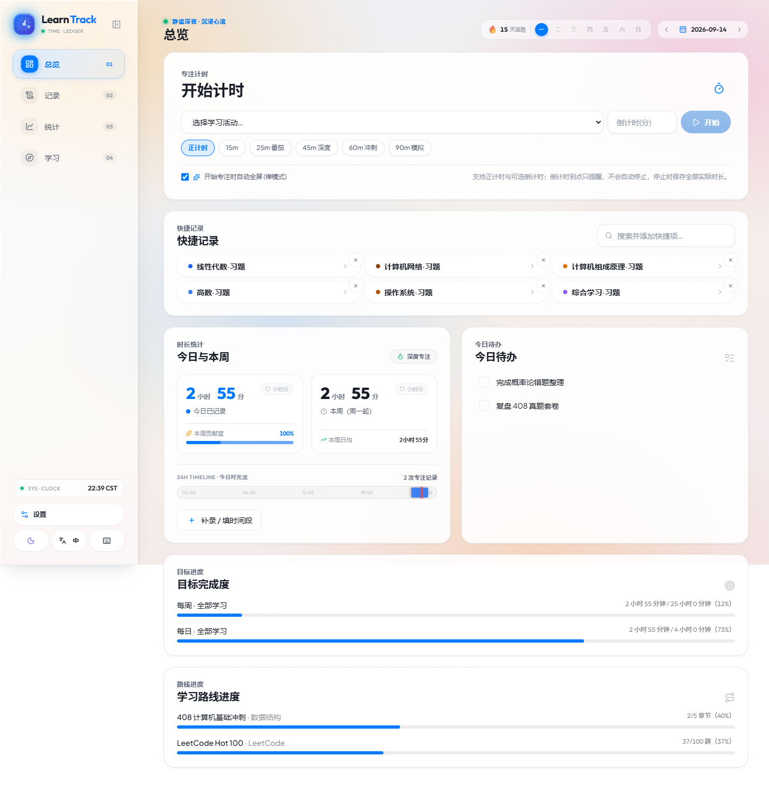
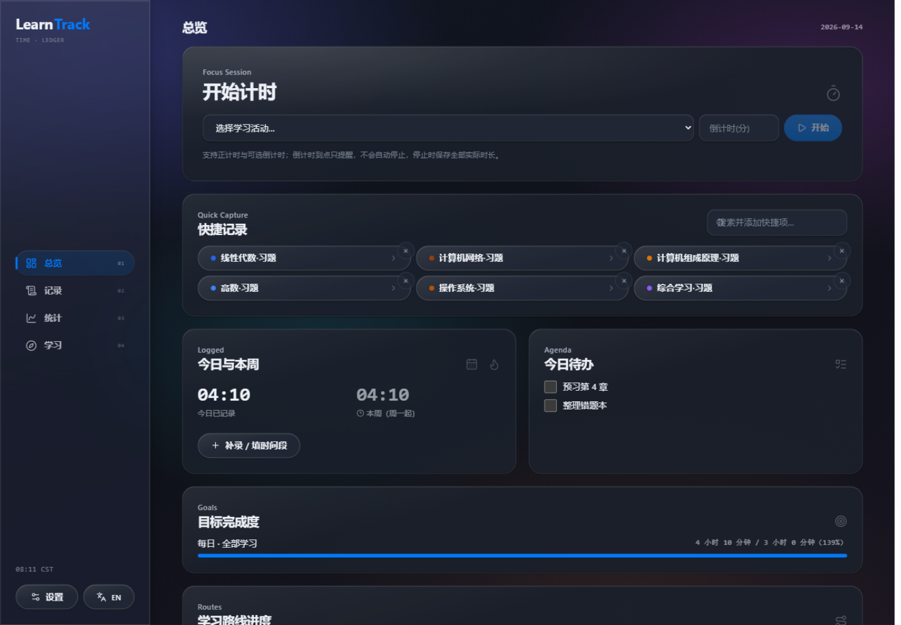
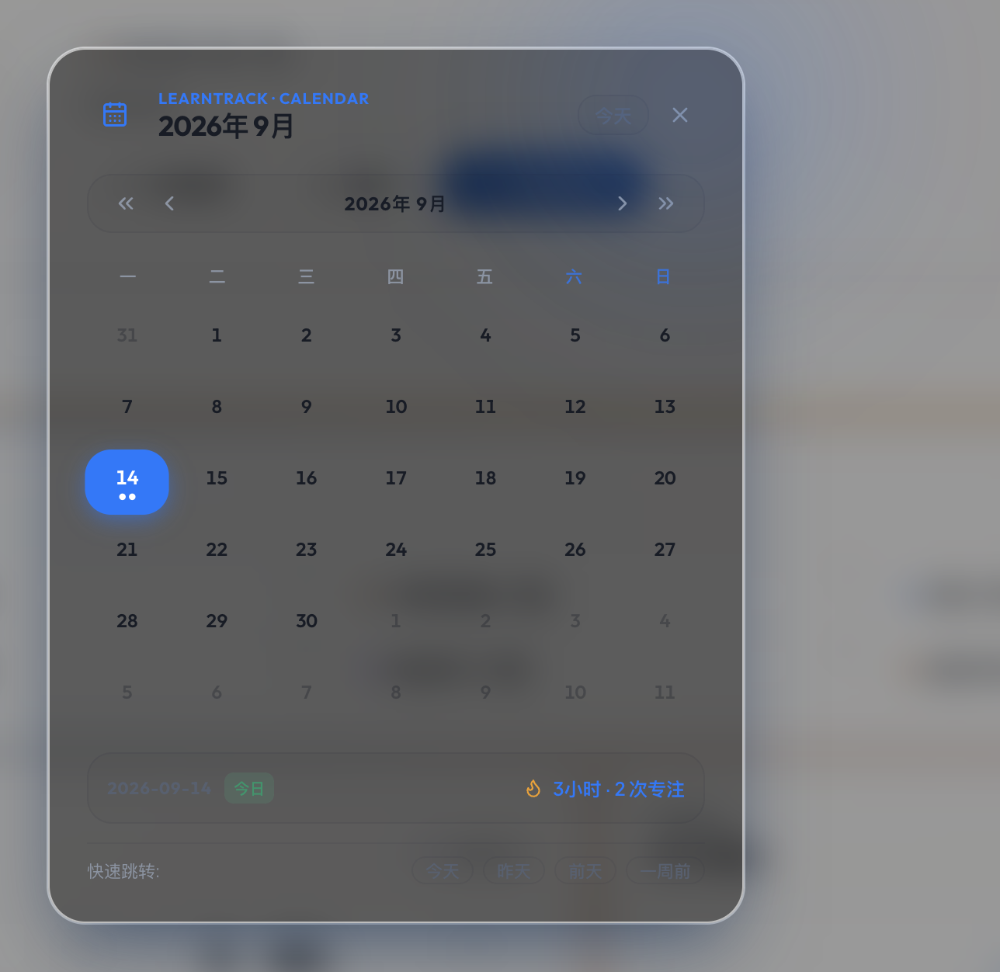
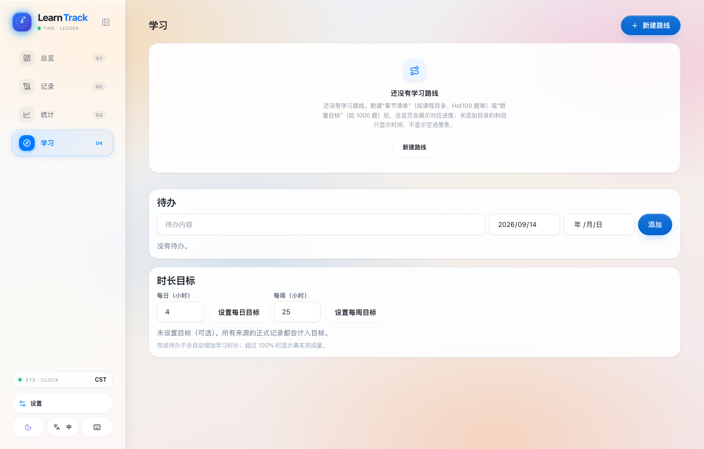
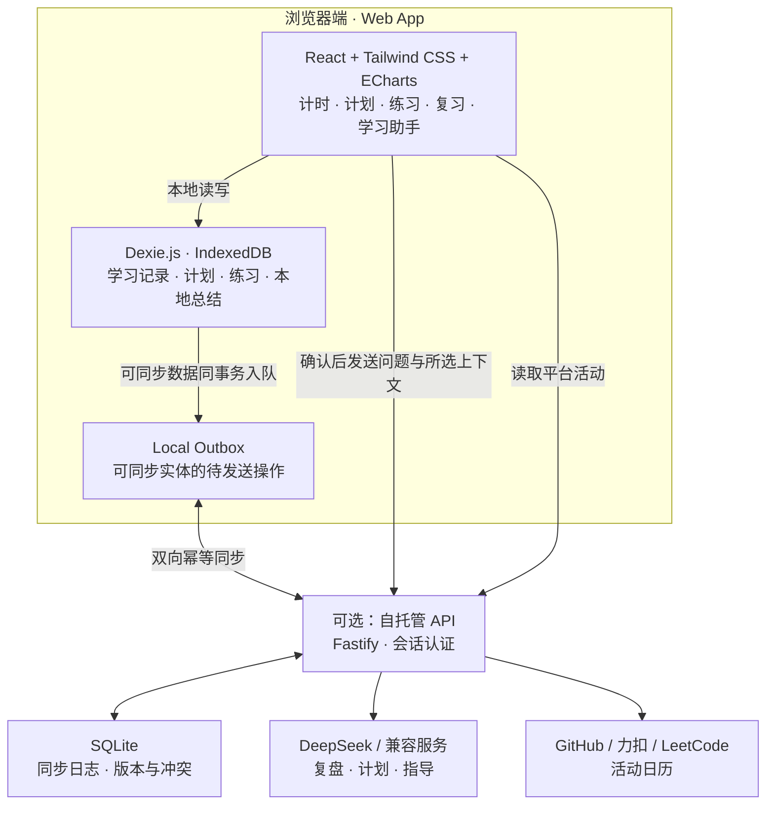

<div align="center">

<p align="center">
  
</p>

<sub>首页预览 · 2026-09-14 历史版本</sub>

# ⏱️ LearnTrack

**本地优先 · 液态玻璃美学 · 考研与编程学习工作台**

*每一次专注都清晰可感，每一份投入皆有迹可循。*

[](LICENSE)
[](https://www.typescriptlang.org/)
[](https://reactjs.org/)
[](https://vitejs.dev/)
[](https://dexie.org/)
[](https://echarts.apache.org/)
[](#-自动化测试与质量保障)
[](#-贡献指南-contributing)

[功能特性](#-核心功能特性) • [UI 视觉与交互美学](#-ui-视觉与交互美学) • [真机运行预览](#-真机运行预览) • [快速开始](#-快速开始) • [架构设计](#-架构设计) • [技术栈](#-技术栈) • [开源协议](#-开源协议-license)

</div>

---

## 🌟 项目简介

**LearnTrack** 是一款本地优先的个人学习工作台，围绕考研数学与编程学习，把每天的计划、专注时间、练习结果和复习安排放在一起。当前重点支持 **2027 考研数学一**，也可以添加自己的科目、资料和学习路线。

从“今天学什么”开始：添加待办、开始计时，练习后记录题号、结果与用时，再根据统计和错题清单调整后续安排。需要一起梳理思路时，可以向学习助手提问，并将自己的总结或保存的回答带入下一次讨论。

学习数据默认保存在当前浏览器的 **IndexedDB** 中。核心记录、计划、练习和统计可在本地使用；多设备同步、DeepSeek 学习助手与 GitHub／力扣活动日历通过可选的自托管 API 提供。界面保留 **液态玻璃、背景光效与机械时计动效**，当前重点维护 Web 端。

---

## 🎨 UI 视觉与交互美学

### 1. 液态玻璃与动态聚光（Liquid Glass & Spotlight）

半透明卡片、边缘高光与背景光晕构成界面的层次。卡片上的柔和聚光随光标移动，配合深浅主题与自定义强调色，让信息保持清晰，也保留玻璃的通透感。

### 2. 持续运转的机械时计（Mechanical Chronograph Logo）

左上角 SVG 时计持续运转，齿轮、轨道和指针以不同速度联动，外层光晕缓慢呼吸。页面隐藏或图标离开可视区域时暂停动画，并尊重系统的减少动态效果设置。

### 3. 全屏沉浸专注模式（Zen Mode & Soundscape）

专注时可切换到全屏大表盘。内置 Web Audio 合成的雨声、海浪与棕色噪声，无需下载外部音频文件，音量和播放由用户控制。

### 4. 稳定排印与左侧导航

使用系统字体，计时与统计数字采用等宽数字排印，减少跳动。Web 菜单固定在左侧，窄窗口收为图标栏；左上角保留导航与主题组合控件。下拉选择、日期选择和弹窗沿用同一套玻璃表面与交互反馈。

### 5. 学习日历与主题配色（Glass Calendar）

日历用彩色活动点标出学习日期，可快速回看历史记录。已有科目和新建科目都支持自定义颜色，便于在记录、筛选与统计中识别。

界面约定与动效规则见 [设计说明](DESIGN.md)。

---

## 📸 真机运行预览

以下保留 **2026-09-14 历史版本的 Windows 桌面浏览器实测截图**，延续原版 README 的展示。截图使用测试数据，不代表当前全部界面；后续新增的计划、练习和学习助手不在这组截图中。测试库通过应用界面录入：共 **16 条学习记录、连续 15 个活跃日、总计 20 小时 50 分钟**，覆盖数学、408、英语、算法与政治五个领域；同时创建 2 条学习路线、2 项今日待办，以及每日 4 小时 / 每周 25 小时目标。

| 实测项 | 2026-09-14 验证数据 |
| :--- | :--- |
| 月度统计 | 2026 年 9 月 15 条记录，14 个活跃日，共 18 小时 40 分钟 |
| 连续记录 | 2026-08-31 至 2026-09-14，连续 15 天 |
| 章节路线 | `408 计算机基础冲刺`：2/5 章，完成 40% |
| 数量路线 | `LeetCode Hot 100`：37/100 题，完成 37% |
| 运行视口 | Chromium 桌面浏览器，1440 × 900 / 1050 |

### 1. 仪表盘全景（Dashboard）

浅色与深色主题均在同一组实测数据下截取。可见今日 2 小时 55 分钟、2 次专注记录、待办、时长目标与路线进度联动。

<p align="center">
  
  
</p>

### 2. 统计看板（Analytics）

切换到“本月”口径后，趋势图、领域分布与具体科目排行均由 9 月份的 15 条记录计算生成，不再使用“加载中”占位画面。

<p align="center">
  
</p>

### 3. 晶体热力日历与复盘穿梭（Glass Calendar）

日历中的彩色活动点来自连续 15 天的真实测试记录；选中 9 月 14 日可回看当日 **2 小时 55 分钟 / 2 次专注**，并可快捷跳转今天、昨天、前天或一周前。

<p align="center">
  
</p>

### 4. 体系化学习路线（Learning Paths）

同时验证章节清单与数量目标两种路线模型：章节勾选、进度条、快捷打卡、今日待办和日/周时长目标均可正常写入并即时更新。

<p align="center">
  
</p>

---

## ✨ 核心功能特性

### ⏱️ 专注计时与时间账本

- **今日待办**：首页第一个模块即可添加任务，开始一天的学习。
- **正计时 / 倒计时**：支持暂停、继续、超额记录与全屏专注；通过时间戳恢复刷新后的计时状态。
- **跨午夜统计**：跨日学习按当地日期拆分统计；同一计时在多个标签页结束时只保存一条记录。
- **自定义科目**：按领域、科目、活动组织记录，新建科目可直接选择和搜索，已有与新增科目均可调整颜色。

### 📅 学习计划与路线

- **按日期安排任务**：设置日期范围、每日时长和题量，按需生成每日待办。
- **调整学习节奏**：支持编辑、暂停、结束和移除计划；修改安排时保留已完成任务。
- **长期路线**：用章节清单或数量目标记录课程、题单进度。

计划目标和任务勾选目前独立管理，不会根据学习记录或练习结果自动判定目标完成。

### 📝 数学练习与错题复习

- **2027 数一资料档案**：内置张宇《30 讲》的 30 个可编辑讲次编号，以及《1000 题》的题号记录入口；讲次可记录标题、用时、备注和完成状态。
- **逐题记录**：按资料、知识点和完整题号记录正确、错误或未作答，支持单题计时、补录、重做、搜索及 JSON 导入导出。
- **复习清单**：错误与未作答题默认三天后复习，重做答对后移出清单；今日页可以直接打开截至所选日期的到期题目。
- **草稿恢复**：在当前标签页内切换页面或刷新，可以继续未保存的练习。

目前尚未核实该版完整官方目录，内置内容是可编辑的学习记录模板，**不包含教材正文、原题或答案**。请使用“高数·极限·A01”这样的完整题号，避免不同章节被当成同一道题。统计口径与草稿保存范围见 [功能与配置说明](docs/study-workspace.md)。

### 📊 时间、正确率与活动日历

- **学习时间分析**：日、周、月趋势，科目分布、单次时长分布与年度学习热力图，支持查看某一天的原始记录。
- **练习分析**：作答正确率、首次正确率、去重题目数、总用时与平均用时。练习和讲次用时独立于学习时间账本，避免重复累加。
- **编程活动**：读取 GitHub、力扣中国和 LeetCode 国际站的活动日历，保留最近一次读取结果供离线查看。

外部日历表示平台活动，不等同于通过题数或学习时长；首次正确率按当前筛选范围内每道题的首次有作答记录计算。

### 💬 DeepSeek 学习助手与总结库

- **独立工作区**：左侧“学习助手”支持复盘、起草计划和学习指导，计划页也有快捷提问入口。
- **发送前确认**：选择今天、近 7 天或近 30 天的学习汇总，查看将要发送的内容后确认；模型建议的任务需另行确认才加入待办。
- **总结留存与复用**：手写或粘贴学习总结、保存 AI 回答、导出 Markdown，并选择最多 3 篇总结带入下一次提问。
- **可扩展 Agent 接口**：服务端提供能力查询与任务执行接口，默认对接 DeepSeek，也可配置兼容 Chat Completions / JSON 输出的服务。

已保存的总结保存在当前浏览器，包含在完整 JSON 备份中，**暂不参与跨设备同步**。原始学习备注不会自动发送，只有展示的汇总和主动选择的总结会随问题提交。

### 🛡️ 本地优先、同步与备份

- **本地使用**：完成首次访问与应用缓存后，核心计时、记录、计划、练习和统计可以离线运行。
- **同步可控**：同步前展示最近一条记录等预览信息，经确认后执行；Outbox 队列处理待同步操作，冲突保留供用户选择。
- **完整备份**：JSON 备份覆盖学习记录、计划、练习和已保存总结，导入前校验结构、计数、校验和与关系；另可导出 CSV 分析学习记录。

浏览器数据可能因清理站点数据或更换设备而丢失，请定期导出完整备份。服务端备份不能替代尚未同步数据与本地总结的浏览器备份。

---

## 🚀 快速开始

### 前置要求

- [Node.js](https://nodejs.org/) ≥ 24.0.0（API 使用内置 SQLite）
- npm ≥ 10.0.0

### 本地开发

```bash
# 1. 克隆代码仓库
git clone https://github.com/PaoPao1021/LearnTrack.git
cd LearnTrack

# 2. 安装 Monorepo 所有依赖
npm ci

# 3. 构建工作区依赖（干净克隆首次运行必需）
npm run build

# 4. 启动前端 Web 开发服务
npm run dev:web
```

启动完成后，在浏览器访问：**`http://localhost:5173`** 即可使用。

### 可选：启动同步与在线扩展（API）

```bash
# 在仓库根目录创建配置，修改其中的密码、盐与会话密钥
cp .env.example .env
# 完成上面的 npm run build 后，显式加载配置启动 API
node --env-file=.env apps/api/dist/app/server.js
```

> 无需启动 API 即可使用本地计时、计划、练习、统计和备份；同步、AI 提问与读取平台活动日历需要 API。

在设置页将同步地址填为 `/` 并登录即可经 Vite 代理访问 API；留空关闭同步。

### 可选：接入 DeepSeek

在服务端 `.env`（生产环境为 `.env.production`）中填写：

```dotenv
LT_AI_BASE_URL=https://api.deepseek.com
LT_AI_MODEL=deepseek-flash
LT_AI_API_KEY=your-server-only-key
```

重启 API 后，在设置页“DeepSeek / 学习助手”读取服务器配置，再进入学习助手提问。密钥只放在服务端，不写入 `VITE_*` 变量或 Git。GitHub 活动日历另需配置 `LT_GITHUB_TOKEN`；力扣使用公开接口，可能受平台请求限制。

接口、模型配置与可扩展任务说明见 [Agent 接口文档](docs/study-workspace.md#agent-接口)。

### 生产部署与保留数据更新

详见 [部署与恢复指南](DEPLOYMENT.md)：提供 Linux/ECS + Docker Compose + Caddy 的同源 HTTPS 配置、环境变量模板、SQLite 一致快照及恢复脚本。生产 API 不直接暴露端口，真实环境变量文件已加入 Git 忽略规则。

已有 ECS 部署请按 [保留数据更新方案](docs/ecs-update.md) 操作：先分别备份各浏览器的完整 JSON 和服务端 SQLite，再沿用原 Compose 项目名、配置及持久卷更新。不要执行 `docker compose down -v`。客户端数据库升级后，不能仅回滚旧前端继续使用。

---

## 🧪 自动化测试与质量保障

Web 测试会读取工作区包的 `dist` 导出，干净克隆后应先构建、再运行测试：

```bash
# TypeScript 检查与生产构建
npm run build

# 全工作区单元测试
npm test
```

截至 2026-10-01 的最近一次验证：生产构建通过，**118 项测试通过**，其中领域层 25 项、API 22 项、Web 71 项。覆盖时间统计、跨标签页计时去重、科目选择、计划与待办写入、练习统计、同步冲突、数据库升级、备份恢复及 Agent 接口校验。

另提供独立浏览器流程检查：

```bash
node scripts/verify-study-ui.cjs
node scripts/verify-review-flows.cjs
node scripts/verify-assistant-ui.cjs
```

浏览器脚本需要运行中的 Web 开发服务、Playwright 运行库和 Chromium 浏览器，可通过 `LT_PLAYWRIGHT_MODULE`、`LT_BROWSER_PATH`、`LT_PREVIEW_ORIGIN` 指定环境。脚本使用隔离的测试数据，详见 [开发验证说明](docs/study-workspace.md#开发验证)。

外部接口测试使用模拟响应，不代表真实 DeepSeek 或 GitHub 账号已接通；实际连接需配置服务端密钥后验证。

---

## 🏛️ 架构设计


```mermaid
flowchart TB
  subgraph Browser["浏览器端 · Web App"]
    UI["React + Tailwind CSS + ECharts<br/>计时 · 计划 · 练习 · 复习 · 学习助手"]
    DB["Dexie.js · IndexedDB<br/>学习记录 · 计划 · 练习 · 本地总结"]
    Outbox["Local Outbox<br/>可同步实体的待发送操作"]
    UI -->|本地读写| DB
    DB -->|可同步数据同事务入队| Outbox
  end

  API["可选：自托管 API<br/>Fastify · 会话认证"]
  SQLite["SQLite<br/>同步日志 · 版本与冲突"]
  AI["DeepSeek / 兼容服务<br/>复盘 · 计划 · 指导"]
  Activity["GitHub / 力扣 / LeetCode<br/>活动日历"]
  Outbox <-->|双向幂等同步| API
  API <--> SQLite
  UI -->|确认后发送问题与所选上下文| API
  UI -->|读取平台活动| API
  API --> AI
  API --> Activity
```

API 密钥保存在服务器。总结库当前只在浏览器留存并随完整备份导出，不进入同步队列。

---

## 🧱 技术栈

| 层次 | 技术选型 | 用途与优势 |
| :--- | :--- | :--- |
| **基础框架** | [React 18](https://react.dev/) + [TypeScript 5.6](https://www.typescriptlang.org/) | 强类型组件化开发，减少接口与状态错误 |
| **工程构建** | [Vite 8](https://vitejs.dev/) + [Rolldown](https://rolldown.rs/) | 开发热更新与生产代码分块 |
| **本地存储** | [Dexie.js](https://dexie.org/) (IndexedDB) | 纯前端本地持久化，支持响应式 liveQuery 查询 |
| **状态流转** | [Zustand 5](https://zustand-demo.pmnd.rs/) | 管理计时器状态并在 LocalStorage 中持久化 |
| **数据可视化** | [Apache ECharts 6](https://echarts.apache.org/) | 按需注册图表，呈现趋势、分布与热力图 |
| **声音系统** | Web Audio API | 在浏览器内合成环境声与交互反馈音 |
| **样式体系** | [Tailwind CSS 3](https://tailwindcss.com/) + 自定义设计令牌 | CSS 变量驱动，支持深/浅主题与强调色切换 |
| **服务端** | Fastify + Node.js SQLite | 会话认证、同步、Agent 与平台活动接口 |
| **多语言** | 自研轻量类型安全 `i18n` | 支持中英文切换；部分新增功能文案仍以中文为主 |

---

## 📁 目录结构

```text
LearnTrack/
├── apps/
│   ├── web/                     # 前端单页应用（PWA · 离线优先）
│   │   ├── public/              # 静态资源与 PWA ServiceWorker
│   │   └── src/
│   │       ├── components/      # 通用液态玻璃组件（Modal, Combobox, Logo, Toast）
│   │       ├── features/        # 业务模块（今日、计划、练习、统计、学习助手等）
│   │       ├── services/        # 声音、备份恢复、同步、练习草稿与总结存储
│   │       ├── stores/          # Zustand 状态机（计时器核心）
│   │       ├── db/              # Dexie 数据库架构与种子数据
│   │       └── styles/          # 全局设计令牌、卡片聚光灯与关键帧动画
│   └── api/                     # 自托管 API（同步、Agent、平台活动）
├── packages/
│   ├── domain/                  # 核心纯函数领域层（时间与练习统计、计划日期、分类模型）
│   └── contracts/               # 跨端 Zod 契约模式（同步、备份与 Agent 协议）
├── docs/                        # 历史截图、功能说明、产品方向与 ECS 更新方案
├── scripts/                     # 浏览器流程检查、服务器备份与恢复脚本
└── infrastructure/              # 容器化部署脚本
```

---

## 🤝 贡献指南 (Contributing)

欢迎通过 Issue 反馈问题或提出建议，也欢迎提交修复和改进：

1. **Fork** 本仓库；
2. 新建你的功能分支 (`git checkout -b feature/amazing-feature`)；
3. 确保生产构建与测试通过 (`npm run build && npm test`)；
4. 提交你的更改 (`git commit -m 'feat: add some amazing feature'`)；
5. 推送到分支 (`git push origin feature/amazing-feature`)；
6. 提交 **Pull Request**！

---

## 📄 开源协议 (License)

本项目采用 [MIT License](LICENSE) 开源协议。你可以自由使用、修改与二次分发，但请保留原作者版权说明。

---

<div align="center">
  <sub>Built with ❤️ for lifelong learners. Keep learning, keep tracking.</sub>
</div>
